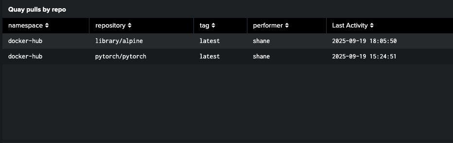
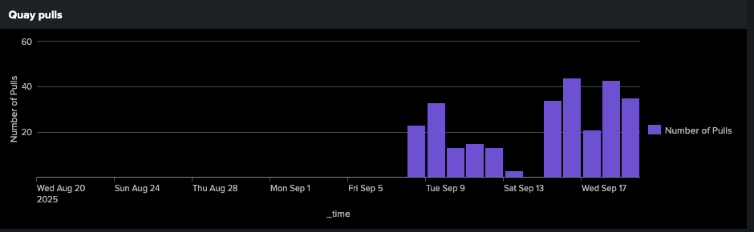
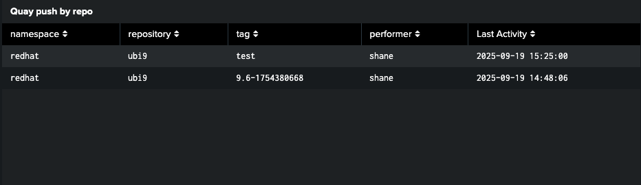
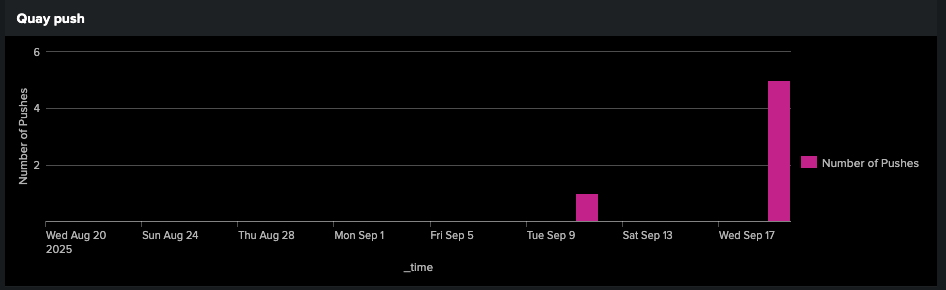
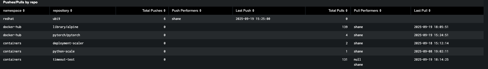

# Quay Splunk Access Logging
This repository contains example Splunk queries for analyzing Quay access logs that are being forwarded to Splunk.

## Configuring Red Hat Quay to Forward Logs to Splunk

To analyze Quay access logs in Splunk, you must first configure Red Hat Quay to forward its logs to your Splunk instance. This can be accomplished using the [Splunk HTTP Event Collector (HEC)](https://docs.splunk.com/Documentation/Splunk/latest/Data/UsetheHTTPEventCollector) as described in the [Red Hat Quay documentation](https://docs.redhat.com/en/documentation/red_hat_quay/3.14/html/manage_red_hat_quay/proc_manage-log-storage#proc_splunk-config).

### Steps to Configure Splunk Logging in Quay

1. **Obtain your Splunk HEC endpoint and token.**
   - You will need the URL (e.g., `https://splunk.example.com:8088`) and a valid HEC token.

2. **Edit your Quay configuration file (`config.yaml`):**
   - Add or update the `LOGGING` section to include a Splunk handler. Example:
 ```yaml
    LOGS_MODEL: splunk
    LOGS_MODEL_CONFIG:
    producer: splunk_hec 
    splunk_hec_config: 
        host: prd-p-aaaaaq.splunkcloud.com 
        port: 8088 
        hec_token: 12345678-1234-1234-1234-1234567890ab 
        url_scheme: https 
        verify_ssl: False 
        index: quay 
        splunk_host: quay-dev 
        splunk_sourcetype: quay_logs 
```
   - Replace `<your-hec-token>`, `<your-index>`, and `<your-sourcetype>` with your actual Splunk configuration values.

3. The Quay operator will reconcile these changes and roll out new app pods

For more details and advanced options, refer to the [official Red Hat Quay documentation on Splunk log configuration](https://docs.redhat.com/en/documentation/red_hat_quay/3.14/html/manage_red_hat_quay/proc_manage-log-storage#proc_splunk-config).

> **Note:**  
> The example Splunk queries in this repository use `index="quay"` and `sourcetype="quay_logs"` as placeholders.  
> **You must update these values in each query to match the actual `index` and `sourcetype` you configured in your Quay and Splunk setup.**

---

## Query: Last Activity for Quay Repository Pulls

This query helps you find the most recent pull activity for each Quay repository tag, along with the user (performer) who performed the last pull. It is useful for auditing and understanding usage patterns of your Quay repositories.

### Splunk Query

```
index="quay" sourcetype="quay_logs" kind="pull_repo"
| stats max(_time) as last_event_epoch, latest(performer) as performer by metadata_json.namespace, metadata_json.repo, metadata_json.tag
| eval "Last Activity" = strftime(last_event_epoch, "%Y-%m-%d %H:%M:%S")
| fields - last_event_epoch
| rename metadata_json.namespace AS namespace, metadata_json.repo AS repository, metadata_json.tag AS tag
| sort -"Last Activity"
```

### Output Columns
- `namespace`: The Quay namespace (organization or user).
- `repository`: The repository name.
- `tag`: The image tag.
- `performer`: The user who last pulled the image.
- `Last Activity`: The timestamp of the last pull event.

### Example

---

## Query: Daily Pull Activity Trend

This query shows the daily trend of image pull activity across all Quay repositories. It is useful for visualizing usage patterns over time and identifying spikes or drops in pull activity.

### Splunk Query

```
index="quay" sourcetype="quay_logs" kind="pull_repo"
| timechart span=1d count AS "Number of Pulls"
```

### Output Columns

- `_time`: The date (per day).
- `Number of Pulls`: The total number of pull events for each day.

### Example

---

## Query: Last Activity for Quay Repository Pushes

This query helps you find the most recent push activity for each Quay repository tag, along with the user (performer) who performed the last push. It is useful for auditing and understanding who is updating images and when.

### Splunk Query

```
index="quay" sourcetype="quay_logs" kind="push_repo"
| stats max(_time) as last_event_epoch, latest(performer) as performer by metadata_json.namespace, metadata_json.repo, metadata_json.tag
| eval "Last Activity" = strftime(last_event_epoch, "%Y-%m-%d %H:%M:%S")
| fields - last_event_epoch
| rename metadata_json.namespace AS namespace, metadata_json.repo AS repository, metadata_json.tag AS tag
| sort -"Last Activity"
```

### Output Columns

- `namespace`: The Quay namespace (organization or user).
- `repository`: The repository name.
- `tag`: The image tag.
- `performer`: The user who last pushed the image.
- `Last Activity`: The timestamp of the last push event.

### Example

---

## Query: Daily Push Activity Trend

This query shows the daily trend of image push activity across all Quay repositories. It is useful for monitoring how frequently new images are being pushed over time.

### Splunk Query

```
index="quay" sourcetype="quay_logs" kind="push_repo"
| timechart span=1d count AS "Number of Pushes"
```

### Output Columns

- `_time`: The date (per day).
- `Number of Pushes`: The total number of push events for each day.

### Example

---

## Query: Push and Pull Activity Summary for Quay Repositories

This query provides a summary of both push and pull activities for each Quay repository. It shows the total number of pushes and pulls, the users who performed them, and the timestamps of the most recent push and pull events. This is useful for auditing repository usage, identifying active contributors, and understanding access patterns.

### Splunk Query

```
index="quay" sourcetype="quay_logs" (kind="push_repo" OR kind="pull_repo")
| stats
    count(eval(kind="push_repo")) as "Total Pushes",
    max(eval(if(kind="push_repo", _time, null()))) as last_push_epoch,
    values(eval(if(kind="push_repo", performer, null()))) as "Push Performers",
    count(eval(if(kind="pull_repo", _time, null()))) as "Total Pulls",
    max(eval(if(kind="pull_repo", _time, null()))) as last_pull_epoch,
    values(eval(if(kind="pull_repo", performer, null()))) as "Pull Performers"
  by metadata_json.namespace, metadata_json.repo
| eval "Last Push" = strftime(last_push_epoch, "%Y-%m-%d %H:%M:%S")
| eval "Last Pull" = strftime(last_pull_epoch, "%Y-%m-%d %H:%M:%S")
| rename metadata_json.namespace AS namespace, metadata_json.repo AS repository
| table namespace, repository, "Total Pushes", "Push Performers", "Last Push", "Total Pulls", "Pull Performers", "Last Pull"
| sort -namespace, -"Total Pushes"
```

### Output Columns

- `namespace`: The Quay namespace (organization or user).
- `repository`: The repository name.
- `Total Pushes`: The total number of push events for the repository.
- `Push Performers`: The users who have pushed images to the repository.
- `Last Push`: The timestamp of the most recent push event.
- `Total Pulls`: The total number of pull events for the repository.
- `Pull Performers`: The users who have pulled images from the repository.
- `Last Pull`: The timestamp of the most recent pull event.

### Example

---

